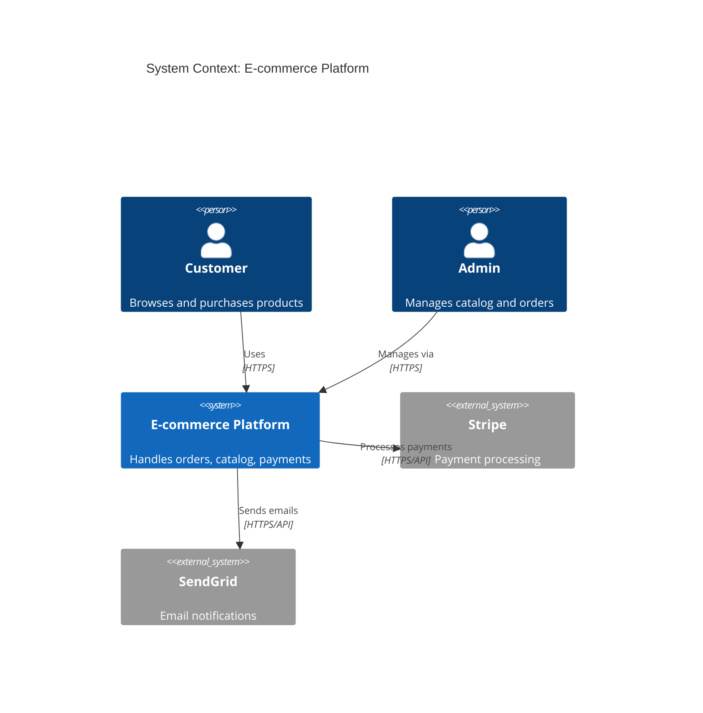
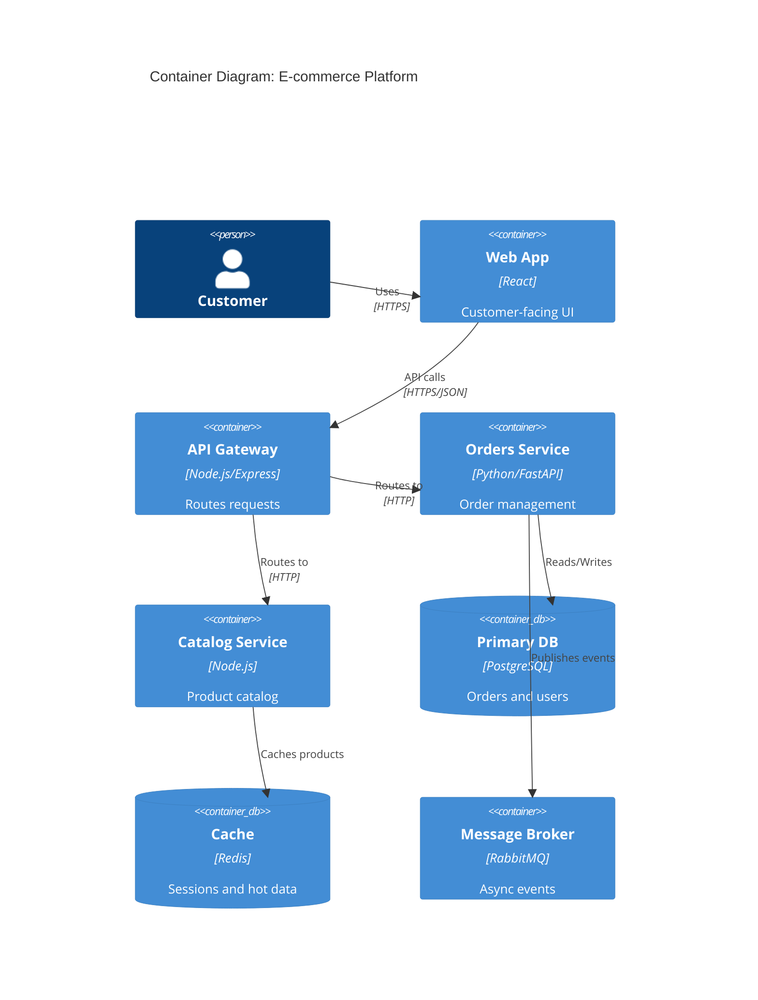

# Software Architect Skill

Design systems that are **scalable**, **maintainable**, and **aligned with business goals**. Produce clear architectural decisions, diagrams, and patterns — not just opinions, but reasoned trade-offs with concrete guidance.

---

## Phase 1: Understand the Problem Space

Before proposing any architecture, establish:

- **Functional requirements**: What must the system do?
- **Non-functional requirements**: Scale, latency, availability, consistency?
- **Team context**: Size, experience, existing stack?
- **Constraints**: Budget, timeline, compliance (GDPR, HIPAA)?
- **Evolution**: How will requirements change in 12–24 months?

**Key principle**: Architecture serves the business. The "best" architecture is the simplest one that meets requirements — not the most sophisticated.

---

## Phase 2: Choose the Right Architectural Style

### Decision Guide

| Context | Recommended Style |
|--------|------------------|
| Small team, early-stage product | Modular Monolith |
| Clear domain boundaries, independent scaling needed | Microservices |
| Complex business logic, rich domain model | Domain-Driven Design (DDD) |
| High read/write asymmetry | CQRS + Event Sourcing |
| Loose coupling between services | Event-Driven Architecture |
| Mixed workloads, gradual migration | Strangler Fig Pattern |

**Warning**: Don't start with microservices. Start with a well-structured monolith. Extract services when you have proven scaling bottlenecks or true team autonomy needs.

---

## Phase 3: Architectural Patterns

### Clean Architecture (recommended default)

```
┌─────────────────────────────────────┐
│           Frameworks & Drivers       │  ← Express, FastAPI, DB, Redis
│  ┌───────────────────────────────┐  │
│  │       Interface Adapters       │  │  ← Controllers, Presenters, Gateways
│  │  ┌─────────────────────────┐  │  │
│  │  │     Application Layer    │  │  │  ← Use Cases / Interactors
│  │  │  ┌───────────────────┐  │  │  │
│  │  │  │   Domain Layer     │  │  │  │  ← Entities, Value Objects, Domain Services
│  │  │  └───────────────────┘  │  │  │
│  │  └─────────────────────────┘  │  │
│  └───────────────────────────────┘  │
└─────────────────────────────────────┘
         Dependencies point INWARD only
```

**Rules**:
- Domain layer has zero dependencies on frameworks or infrastructure
- Application layer depends only on domain
- Infrastructure depends on application interfaces (dependency inversion)

### Hexagonal Architecture (Ports & Adapters)

```
        [ HTTP ]  [ CLI ]  [ Events ]
             ↓       ↓        ↓
         ┌──────────────────────┐
         │   PRIMARY ADAPTERS   │
         └──────────┬───────────┘
                    │ (Ports)
         ┌──────────▼───────────┐
         │    DOMAIN / CORE     │
         └──────────┬───────────┘
                    │ (Ports)
         ┌──────────▼───────────┐
         │  SECONDARY ADAPTERS  │
         └──────────────────────┘
        [ DB ]  [ Email ]  [ Queue ]
```

**Use when**: You need to swap infrastructure (e.g., change DB or message broker) without touching business logic.

### Modular Monolith

```
monolith/
├── modules/
│   ├── users/         # self-contained: routes, logic, DB models
│   ├── orders/
│   ├── payments/
│   └── notifications/
├── shared/            # shared kernel: types, utils, events
└── infrastructure/    # DB, cache, mailer setup
```

**Rules**:
- Modules communicate via **interfaces/events**, never direct imports across domains
- Each module owns its data — no cross-module DB joins
- This structure enables future extraction to microservices

---

## Phase 4: Microservices & Cloud

### When to Use Microservices
Only extract a service when you have:
- Independent deployment requirements
- Proven scaling bottleneck in a specific domain
- Separate team ownership
- Significantly different tech requirements

### Service Communication Patterns

| Pattern | When to use |
|--------|-------------|
| **REST/HTTP** | Simple request-response, external APIs |
| **gRPC** | High-performance internal service calls |
| **Async messaging (Kafka, RabbitMQ, SQS)** | Decoupled events, eventual consistency |
| **GraphQL Federation** | Multiple services, unified API for clients |

### Event-Driven Pattern
```
Service A ──publishes──► [Message Broker] ──delivers──► Service B
                                          └──delivers──► Service C
```

**Key rules**:
- Events are facts: `OrderPlaced`, not `CreateOrder`
- Events are immutable — never update, only append
- Each service maintains its own read model (no shared DB)
- Design for idempotency — events may be delivered more than once

### Cloud Architecture Principles
- **Stateless services**: State in DB/cache, not in memory
- **12-Factor App**: Config via env vars, logs to stdout
- **Health endpoints**: `/health` (liveness) and `/ready` (readiness)
- **Circuit breaker**: Fail fast when downstream services are down
- **Retry with backoff**: Exponential backoff + jitter for transient failures
- **Observability**: Structured logs + distributed tracing (OpenTelemetry) + metrics

---

## Phase 5: C4 Diagrams (Mermaid)

Always provide diagrams at the appropriate level. Use Mermaid syntax.

### Level 1 — System Context


### Level 2 — Container Diagram


---

## Phase 6: Architecture Decision Records (ADRs)

Write an ADR for every significant technical decision. Keep them short and permanent.

### ADR Template
```markdown
# ADR-001: [Title — short decision statement]

**Date**: YYYY-MM-DD
**Status**: Proposed | Accepted | Deprecated | Superseded by ADR-XXX

## Context
What is the situation forcing this decision? What constraints exist?
(2–4 sentences max)

## Decision
What have we decided to do?
(1–3 sentences, clear and unambiguous)

## Options Considered
| Option | Pros | Cons |
|--------|------|------|
| Option A (chosen) | ... | ... |
| Option B | ... | ... |
| Option C | ... | ... |

## Consequences
**Positive**: What becomes easier or better?
**Negative**: What becomes harder? What debt are we accepting?
**Risks**: What could go wrong?

## References
- Links to relevant docs, RFCs, benchmarks
```

### Example ADR
```markdown
# ADR-003: Use PostgreSQL as primary database

**Date**: 2024-01-15
**Status**: Accepted

## Context
We need a primary datastore for user accounts, orders, and product catalog.
The system requires ACID transactions for order processing and complex queries
for reporting.

## Decision
Use PostgreSQL as the primary relational database for all core domain data.

## Options Considered
| Option | Pros | Cons |
|--------|------|------|
| PostgreSQL (chosen) | ACID, rich query support, JSONB, mature | Vertical scaling limits |
| MongoDB | Flexible schema, horizontal scale | No ACID across collections |
| MySQL | Widely known | Less advanced feature set |

## Consequences
**Positive**: Strong consistency guarantees, powerful queries, great tooling (Prisma, SQLAlchemy).
**Negative**: Requires careful schema migration management.
**Risks**: Scaling beyond ~10M rows will require read replicas or sharding strategy.
```

Store ADRs in: `docs/adr/ADR-001-title.md`

---

## Phase 7: Architecture Review Checklist

Before finalizing any architecture proposal:

**Correctness**
- [ ] All functional requirements are addressed
- [ ] Non-functional requirements have explicit strategies (scale, latency, availability)
- [ ] Data ownership is clear — no shared databases across services

**Simplicity**
- [ ] Is this the simplest architecture that meets requirements?
- [ ] Could this start as a monolith and evolve later?
- [ ] Are we solving problems we actually have, not hypothetical ones?

**Resilience**
- [ ] Single points of failure identified and mitigated
- [ ] Failure modes documented (what happens when X goes down?)
- [ ] Circuit breakers / retries planned for external dependencies

**Operability**
- [ ] Health check endpoints defined
- [ ] Logging, metrics, tracing strategy defined
- [ ] Deployment strategy documented (blue/green, canary, rolling)
- [ ] Rollback strategy defined

**Documentation**
- [ ] C4 diagram at least at Context + Container level
- [ ] Key decisions captured as ADRs
- [ ] README with system overview and setup instructions

---

## Delivery Format

Always deliver architectural work as:
1. **Diagram** (Mermaid C4 at appropriate level)
2. **Decision summary** (what and why, in plain language)
3. **Trade-offs** (what we gain, what we give up)
4. **ADR** (for significant decisions)
5. **Next steps** (concrete implementation sequence)

Never just recommend a pattern — always explain *why* it fits this specific context.
